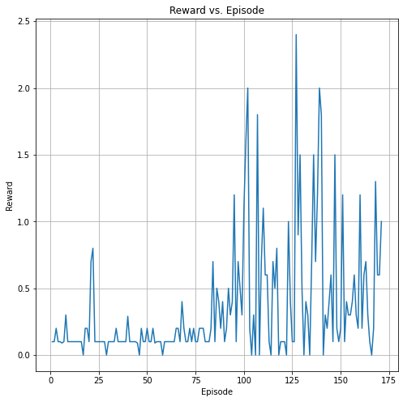

# Report: Collaboration and Competition Project

## Introduction
This report describes the approach and results for the Collaboration and Competition project, where two agents were trained to play tennis.

## Learning Algorithm
- **Algorithm**: Deep Deterministic Policy Gradient (DDPG).
- **Actor-Critic Architecture**: Used for learning policies in a continuous action space.

## Neural Network Architectures
- **Actor**: Fully connected layers with ReLU activation, outputting actions.
- **Critic**: Evaluates the state-action pairs, also with fully connected layers.

## Hyperparameters
- Replay buffer size: 1e6
- Batch size: 256
- Discount factor (gamma): 0.99
- Soft update parameter (tau): 1e-3
- Learning rates: Actor - 5e-4, Critic - 1e-3
- Weight decay: 0

## Training Process and Results

- The agents were trained in the Tennis environment.
- The goal was to maintain an average score of +0.5 over 100 episodes.
- The environment was solved in 71 episodes with an average score of 0.51
- Training details and episode scores are presented in `Tennis.ipynb`.

## Conclusion
- The agents successfully learned to play tennis, achieving the target average score.
- The DDPG algorithm proved effective for this multi-agent cooperation task.

## Future Work
- Experimenting with different algorithms like PPO or TRPO.
- Further tuning of hyperparameters.
- Exploring multi-agent learning strategies for enhanced cooperation.

## Additional Challenge: Soccer Environment
- The next challenge involves training agents in a more complex Soccer environment.
