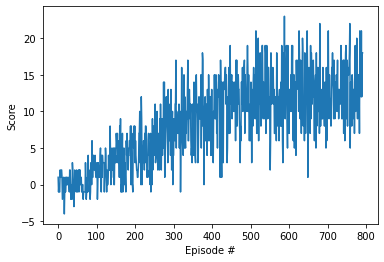

# Report: Project 1 - Navigation

In this project, I have trained a deep reinforcement learning agent to collect (yellow) bananas in the Unity Banana Collector environment.

A reward of +1 is provided for collecting a yellow banana, and a reward of -1 is provided for collecting a blue banana.  Thus, the goal of the agent is to collect as many yellow bananas as possible while avoiding blue bananas.  

The state space has 37 dimensions and contains the agent's velocity, along with ray-based perception of objects around agent's forward direction. Given this information, the agent has to learn how to best select actions. Four discrete actions are available, corresponding to:
- **`0`** - move forward.
- **`1`** - move backward.
- **`2`** - turn left.
- **`3`** - turn right.

The task is episodic, and in order to solve the environment, the agent must get an average score of +13 over 100 consecutive episodes.

## Implementation

This deep reinforcement learning agent is implemented using PyTorch and is designed for environments with continuous or discrete state and action spaces. The core components of this implementation include a neural network model for the agent's policy and methods for interacting with and learning from the environment.

### Neural Network Architecture (model.py)

QNetwork Class: Represents the Actor (Policy) Model.
Layers: Comprises fully connected layers with 256 neurons each, designed to map states to action values.
Activation: Uses ReLU activation for hidden layers.

### Agent Mechanics (dqn_agent.py)

Agent Class: Manages interactions with the environment and learning process.
Replay Buffer: Utilizes a replay buffer to store and sample experiences, aiding in stable learning.
Learning Strategy: Employs the Deep Q-Network (DQN) approach, updating the agent's knowledge based on sampled experiences from the replay buffer.
Target Network: Includes a mechanism for soft updates to the target network, ensuring gradual learning.
Device Adaptation: The code is adapted to leverage GPU acceleration, including compatibility with Apple's M1 chip using MPS when available, falling back to CPU otherwise.
This agent's implementation is optimized for robust performance and efficiency, capable of handling complex environments and tasks in reinforcement learning.

### Hyperparameters

In the Deep Reinforcement Learning (DRL) agent, several hyperparameters have been chosen to optimize the learning process:

1. **BUFFER_SIZE (100,000)**: This defines the size of the replay buffer, a data structure used to store and recall experience tuples (state, action, reward, next state). A larger buffer allows the agent to remember and learn from more experiences, potentially improving learning quality.

2. **BATCH_SIZE (64)**: This is the number of experience tuples that the agent samples from the replay buffer for learning. A batch size of 64 strikes a balance between computational efficiency and the quality of learning from diverse experiences.

3. **GAMMA (0.99)**: The discount factor determines the importance of future rewards. A value of 0.99 places high importance on future rewards, encouraging the agent to plan over a longer time horizon.

4. **TAU (0.001)**: This parameter is used for the soft update of the target network. It controls how much the target network's weights are updated towards the local network's weights. A small value like 0.001 ensures gradual updates, providing stability to the learning process.

5. **LR (0.0005)**: The learning rate defines how much the neural network weights are updated during training. A smaller learning rate ensures that learning is more stable but can slow down the learning process.

6. **UPDATE_EVERY (4)**: This parameter specifies how often the network is updated. In this case, the network updates every 4 time steps, balancing between learning frequently and computational efficiency.

7. **n_episodes (2000)**: The maximum number of training episodes. This sets the upper limit on how many times the agent will iterate through the environment during training.

8. **max_t (1000)**: The maximum number of timesteps per episode. It caps the length of each episode, ensuring episodes don’t run indefinitely.

9. **eps_start (1.0), eps_min (0.01), eps_decay (0.995)**: These parameters control the epsilon-greedy strategy for action selection. `eps_start` is the starting value of epsilon, `eps_min` is the minimum value, and `eps_decay` is the rate at which epsilon decays after each episode. This strategy balances exploration (trying new things) and exploitation (using known information).

## Results

The deep reinforcement learning agent solved this environment in 692 episodes with an average score of 13.06.

## Improvement Ideas

Improving the Deep Reinforcement Learning (DRL) agent can be approached from several angles. Possible suggesttions for improvement in the future include: 

Advanced Neural Network Architectures: Experiment with more complex neural network architectures such as convolutional neural networks (CNNs) for environments with visual inputs, or recurrent neural networks (RNNs) for environments with temporal dependencies.

Hyperparameter Tuning: Use techniques like grid search, random search, or Bayesian optimization to find more optimal hyperparameters. This can significantly affect the agent's performance.
Double DQN: Implement Double DQN to mitigate the overestimation of Q-values in standard DQN. This approach uses two networks to decouple the action selection from the target Q-value generation.

Prioritized Experience Replay: Modify the replay buffer to prioritize important experiences, so the agent can learn more effectively from significant but rare events.
Dueling DQN: Implement Dueling DQN, where the network estimates the value of being in a state and the advantage of each action separately. This can lead to better policy evaluation in environments with many similar-valued actions.

Multi-Step Learning: Instead of updating the agent’s knowledge based on single-step transitions, consider using n-step returns for updates, which can help in learning more effectively from sequences of actions.

Noisy Nets for Exploration: Integrate noisy networks to handle exploration, which adds parameter noise to the network weights, potentially leading to more sophisticated exploration behaviors than epsilon-greedy strategies.

Rainbow DQN: Combine several improvements like Double DQN, Prioritized Experience Replay, and Dueling Networks into a single algorithm (known as Rainbow) for potentially better performance.
Curriculum Learning: Gradually increase the complexity of the environment or the tasks the agent must learn. This can be particularly effective for complex tasks.

Transfer Learning: Utilize a pre-trained network on a similar task to speed up learning, especially useful in environments where data collection is expensive.

Actor-Critic Methods: Explore actor-critic methods like A2C (Advantage Actor-Critic) or A3C (Asynchronous Advantage Actor-Critic), which can offer more stable and often faster training.

Distributional DQN: Instead of estimating the expected value of Q-values, estimate the entire distribution of Q-values, which can provide more information about the expected returns.